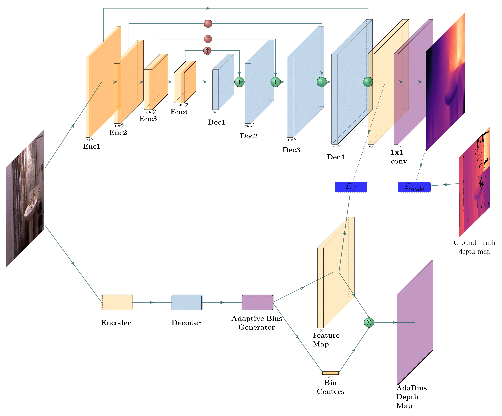

<p align="center">
  <a href="" rel="noopener">
    
  </a>
</p>

<h3 align="center">AdaLite: A Distilled AdaBins Model for Depth Estimation on Resource-Limited Devices</h3>

---

<p align="center"> 
    AdaLite is a lightweight depth estimation framework designed for deployment on devices with limited resources. Instead of relying on quantization or pruning, it distills knowledge from a large teacher model into a compact encoder–decoder student network. Trained with dual supervision (teacher feature maps + ground-truth depth), AdaLite achieves up to 90% model size reduction and significantly faster inference while preserving competitive accuracy. Evaluated on NYUv2 and KITTI, it balances accuracy and efficiency, making it suitable for real-time applications on low-power hardware.
</p>

## 📝 Table of Contents

- [Getting Started](#getting_started)
- [Installation](#installation)
- [Data Download](#data-download)
- [Training and Evaluation](#training-evaluation)
- [Model Checkpoints](#model-checkpoints)
- [Author](#author)


## 🏁 Getting Started <a name="getting_started"></a>

These instructions will help you set up and run the project on your local machine for training and evaluation purposes.

### Prerequisites

Ensure you have Git installed, then clone the repository:

```bash
git clone https://github.com/Chaouki-AI/AdaLite
cd AdaLite/
```

## 📦 Installation <a name="installation"></a>

Ensure you have [Anaconda](https://www.anaconda.com/) installed on your machine. Then, run the following command to set up the environment:

```bash
chmod +x ./setup/installEnv.sh
./setup/install.sh
conda activate AdaLite
```

## 📂 Data Download <a name="data-download"></a>

Follow the instructions in the [LIDAR-DATABOX](https://github.com/Chaouki-AI/LIDAR-DATABOX/) repository to download datasets such as KITTI, NYUv2, and others used for training and evaluation of depth estimation models.

please [Download](https://drive.google.com/drive/folders/1nYyaQXOBjNdUJDsmJpcRpu6oE55aQoLA) the checkpoints of the trained model (here we use AdaBins) which will be used as teacher in the training process, then save them in the following 

## 🚀 Training and Evaluation <a name="training-evaluation"></a>

### Training

To train the model, update the `args.txt` file (examples can be found in the `args` folder). Then, start training with:

```bash
python main.py @args.txt
```
By default, Checkpoints will be saved in the `checkpoints` folder, and TensorBoard logs will be stored in the `runs` folder. You can change it using the `args.txt` file.

### Evaluation

To evaluate the model, create an `args.txt` file as provided in the `args/eval/` folder (e.g., `eval_nyu_b1.txt`). Then, run:

```bash
python evaluation.py @args/eval/eval_args_nyu_b1.txt
```


The evaluation results will be saved as a `.txt` file in the `Eval_result` folder, timestamped for easy identification.

## 📌 Model Checkpoints <a name="model-checkpoints"></a>

Below are the model checkpoints for the KITTI and NYUv2 datasets, along with their evaluation metrics:

| Dataset  | a1    | a2    | a3    | Abs Rel | RMSE  | Log_10 | RMSE Log | SILog  | Sq Rel | Checkpoint |
|----------|-------|-------|-------|---------|-------|--------|----------|--------|--------|------------|
| KITTI | 0.950 | 0.992 | 0.998 | 0.070 | 2.861 | 0.030 | 0.106   | 9.972 | 0.285 | [Download](https://univsbadz-my.sharepoint.com/:f:/g/personal/chaouki_ziara_univ-sba_dz/ErOQzGUNNkJGn6lBbKNk9tMBiu2p9l2V8xucLOyv_qSffw?e=nvSfyJ)  |
| NYUv2 | 0.866 | 0.978 | 0.995 | 0.119 | 0.419 | 0.050 | 0.150   | 12.362 | 0.072 | [Download](https://univsbadz-my.sharepoint.com/:f:/g/personal/chaouki_ziara_univ-sba_dz/ErOQzGUNNkJGn6lBbKNk9tMBiu2p9l2V8xucLOyv_qSffw?e=nvSfyJ)  |

## ✍️ Author <a name="author"></a>

[M. Chaouki ZIARA](https://github.com/Chaouki-AI) is affiliated with the RCAM Laboratory, Department of Electronics, Djillali Liabes University, Sidi Bel Abbes, Algeria. (Email: chaouki.ziara@univ-sba.dz, medchaoukiziara@gmail.com) – concept creator, algorithm development, implementation, and manuscript writing.